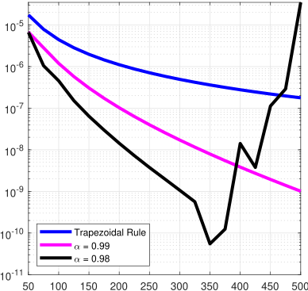
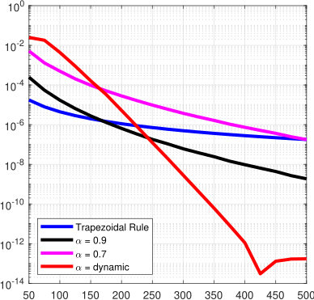
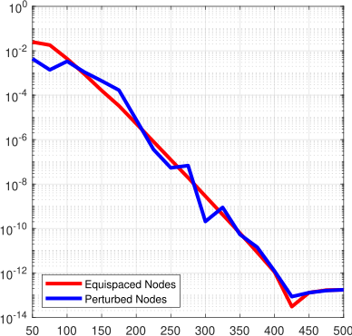
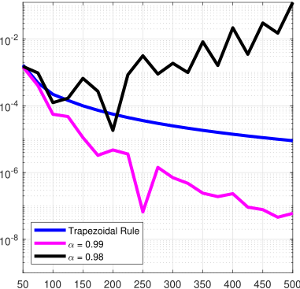
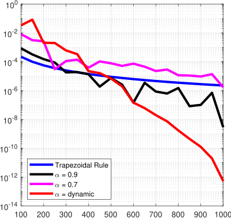
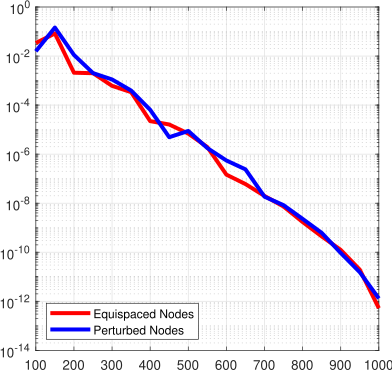
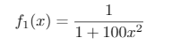
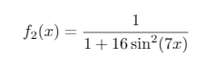

# KTL and KTI quadrature formulas

MATLAB code for KTL and KTI quadrature forlumas.

## Quote this work

To use this work in any scientific report or publication, please cite:

* G. Cappellazzo, W. Erb, F. Marchetti, D. Poggiali, *On Kosloff Tal-Ezer least-squares quadrature formulas*.

## Quadrature with Kosloff and Tal-Ezer map

We study a global quadrature scheme for analytic functions on compact intervals based on function values on **arbitrary grids** of quadrature nodes. In practice it is not always possible to sample functions on optimal nodes with a low-order Lebesgue constant. Therefore, we go beyond classical interpolatory quadrature by lowering the degree of the polynomial approximant and by applying auxiliary mapping functions that map the original quadrature nodes to more suitable **fake nodes**. More precisely, we investigate the combination of the **Kosloff Tal-Ezer map** and **least-squares approximation** (KTL) for numerical quadrature: a careful selection of the mapping parameter ensures a high accuracy of the approximation and, at the same time, an asymptotically optimal ratio between the degree of the polynomial and the spacing of the grid. 

KTI quadrature | KTL quadrature | Perturbed nodes 
:------------: | :-------------: | :------------: 
 |  |  
 |  |  

**x-axis:** number of nodes - **y-axis:** Absolute Relative Error.

To test the [scheme](img/pseudo_code_git.pdf), we use analytic functions in an open neighborhood of [−1, 1]: 

  &nbsp; &nbsp; &nbsp; &nbsp; &nbsp; &nbsp; &nbsp; &nbsp; &nbsp; &nbsp; (first row)

 &nbsp; &nbsp; &nbsp; &nbsp; &nbsp; &nbsp; (second row)

Numerical tests on equispaced nodes show that some static choices of the map's parameter improve the results of the composite trapezoidal rule, while a dynamic 
approach achieves larger stability and faster convergence, even when the sampling nodes are perturbed.

### Poster: On Kosloff Tal-Ezer least-squares quadrature formulas

We presented this work as a [poster](poster/Poster_KTL.pdf) at "[5th Dolomites Workshop on Constructive Approximation and Applications](https://events.math.unipd.it/dwcaa21/)".
